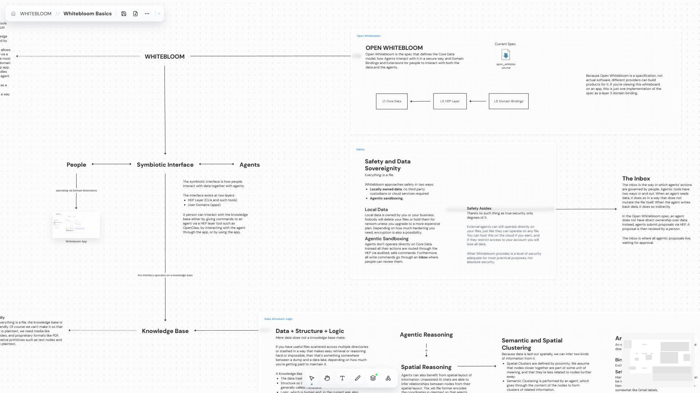

# Whitebloom Workspace

This is a workspace that I'll be using as I work on Whitebloom, and that you can use to get an idea for what the project is. Just clone the repo and open it from [Whitebloom](https://github.com/whitevanillaskies/whitebloom).

It has boards for experimental features I'd like to add, Whitebloom's philosophy, what I'm working on right now, etc.

Socials: Follow me on [X](https://x.com/__whitebloom__)